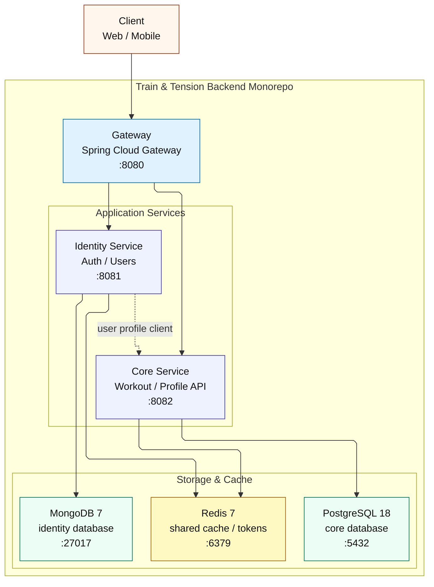
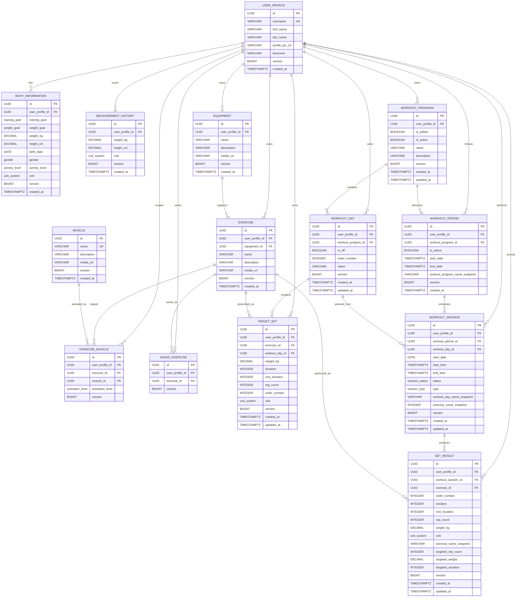
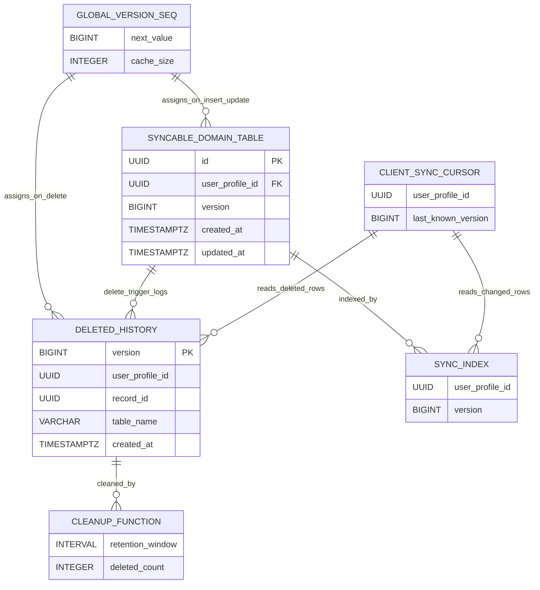

# Train & Tension Backend

Train & Tension Backend is a runnable Spring-based backend monorepo for the platform's gateway, identity, core domain API, and shared backend library. The repository brings multiple backend services together under a Maven reactor and provides local infrastructure with Docker Compose.

The project is designed as a small microservice backend: external clients enter through the gateway, authentication and user management live in the identity service, workout/profile domain operations live in the core service, and shared concerns are extracted into a local common module.

## Key Engineering Highlights

- Consolidated gateway, identity, core, and shared common modules into a Maven multi-module monorepo.
- Built a runnable local backend environment with Docker Compose, PostgreSQL, MongoDB, Redis, and service healthchecks.
- Implemented gateway-based routing for identity and core APIs through Spring Cloud Gateway.
- Separated authentication/user management from workout/profile domain logic with service-to-service communication.
- Used PostgreSQL, Flyway, and jOOQ for relational domain data; MongoDB for identity data; Redis for token and cache state.
- Added GitHub Actions CI to validate Maven builds and Docker Compose configuration.

## Architecture



## Services

- `services/gateway`: Reactive Spring Cloud Gateway entrypoint. It routes `/api/identity/**` and `/api/core/**` traffic to the internal services and exposes Swagger routes for local inspection.
- `services/identity`: Authentication and user management service. It stores identity data in MongoDB, uses Redis for refresh token state, signs JWTs, and calls `core` when a user profile must be created.
- `services/core`: Workout, profile, sync, and catalog domain API. It uses PostgreSQL as the source of truth, Flyway for schema migrations, jOOQ for type-safe SQL access, Redis for shared cache state, and Caffeine for local in-memory caching.
- `libs/common`: Shared DTOs, exceptions, user context utilities, role checks, and cross-service support code.

## Core Domain Model

The core service domain is derived from the Flyway migrations under `services/core/src/main/resources/db/migration`. It models user fitness profiles, body measurements, exercise catalogs, workout plans, scheduled/completed sessions, completed set results, saved exercises, and client synchronization state.



### Sync and Delete Tracking

The core schema also includes a version-based synchronization mechanism. Inserts and updates receive a global version number, while deletes are recorded separately in `deleted_history` so clients can reconcile removed records.



Core migration rules worth highlighting:

- System catalog records are represented with `user_profile_id IS NULL`; user-specific records are scoped with `user_profile_id`.
- Every syncable domain table receives a monotonically increasing `version` from `global_version_seq`.
- Delete operations are captured in `deleted_history`, which lets clients sync removals as well as inserts and updates.
- `target_set` and `set_result` enforce exactly one effort type: either `rep_count` or `duration`.
- A user can have only one active workout program, while system workout programs are prevented from being active.
- Equipment uniqueness is split between global system equipment names and per-user equipment names.
- Workout sessions and set results keep snapshot fields so historical workout records remain readable even if catalog data changes later.

## Technology Stack

| Area | Technology |
| --- | --- |
| Language | Java 25 |
| Framework | Spring Boot 4 |
| API Gateway | Spring Cloud Gateway WebFlux |
| Core API | Spring Web MVC |
| Build / Monorepo | Maven multi-module reactor |
| Relational Database | PostgreSQL 18 |
| Document Database | MongoDB 7 |
| Cache / Token State | Redis 7 |
| Database Migrations | Flyway |
| SQL Access | jOOQ |
| API Documentation | Springdoc OpenAPI / Swagger UI |
| Infrastructure | Docker and Docker Compose |
| CI | GitHub Actions |

## Repository Layout

```text
.
+-- compose.yaml
+-- infra/
|   +-- docker/
+-- libs/
|   +-- common/
+-- scripts/
|   +-- generate-jwt-env.ps1
|   +-- generate-jwt-env.sh
+-- services/
    +-- core/
    +-- gateway/
    +-- identity/
```

## Design Notes

- The repository uses a monorepo layout so the services and shared library can be built together with one Maven command.
- Each service keeps its own Spring Boot application, Dockerfile, runtime configuration, and port.
- `common` is included as a local Maven module, so local and Docker builds do not require GitHub Packages credentials.
- The gateway is the public backend entrypoint. Service-to-service communication stays inside the Compose network.
- `identity` and `core` both use the same Redis instance, but with separate logical responsibilities.
- `identity` uses MongoDB because user/auth data is document-oriented and evolves independently from the workout domain.
- `core` uses PostgreSQL with Flyway and jOOQ for relational domain data, migrations, and type-safe SQL queries.
- Service startup is guarded by Docker healthchecks so dependent services wait for infrastructure and upstream services to become healthy.

## Prerequisites

- Docker Desktop with Docker Compose.
- OpenSSL for generating local ES256 JWT keys.
- Java 25 only if you want to run Maven locally outside Docker.

## Run Locally

Generate the local `.env` file and JWT key pair:

```powershell
.\scripts\generate-jwt-env.ps1
```

On macOS/Linux:

```sh
./scripts/generate-jwt-env.sh
```

Start the full stack:

```sh
docker compose up --build
```

If you previously started the stack with an older schema or PostgreSQL version, reset local volumes before starting again:

```sh
docker compose down -v
docker compose up --build
```

Default URLs:

- Gateway: `http://localhost:8080`
- Identity through gateway: `http://localhost:8080/api/identity`
- Core through gateway: `http://localhost:8080/api/core`
- Identity Swagger: `http://localhost:8081/swagger/identity/swagger-ui`
- Core Swagger: `http://localhost:8082/swagger/core/swagger-ui`

## Build Locally

Build everything with the Maven reactor:

```sh
./mvnw clean package -DskipTests
```

Build a single service and its dependencies:

```sh
./mvnw -pl services/core -am package -DskipTests
./mvnw -pl services/identity -am package -DskipTests
./mvnw -pl services/gateway -am package -DskipTests
```

## Configuration

Copy `.env.example` or run the key generation script to create `.env`. The generated `.env` is for local development only and is intentionally ignored by git.

Important variables:

- `JWT_PRIVATE_KEY`: PKCS#8 DER base64 private key used by `identity`.
- `JWT_PUBLIC_KEY`: X.509 DER base64 public key used by `gateway`.
- `CORE_DB_*`: PostgreSQL 18 settings for `core`; Flyway migrations use the built-in `uuidv7()` function.
- `ID_MONGO_*`: MongoDB settings for `identity`.
- `REDIS_*`: Shared Redis settings.
- `SWAGGER_ENABLED`: Enables Springdoc routes for local inspection.

## Reliability Checks

- GitHub Actions validates the Maven reactor build on every push and pull request.
- Docker Compose config is validated in CI.
- PostgreSQL, MongoDB, Redis, `core`, `identity`, and `gateway` have local healthchecks.
- Service startup ordering waits for dependencies to become healthy before dependent services start.
- Spring Actuator health endpoints are used by service healthchecks.

## Ownership and Rights

Copyright (c) 2026 Ahmet Baha Aktürk. All rights reserved.

This repository is published as a portfolio and graduation project showcase. Unless a separate license is provided, the source code, architecture, documentation, and related assets may not be copied, redistributed, or used commercially without permission from Ahmet Baha Aktürk.

## Status

The local stack is runnable with Docker Compose and includes the gateway, identity service, core service, PostgreSQL, MongoDB, and Redis.
