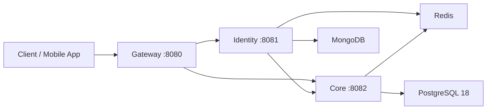

# Train & Tension Backend

This repository is a runnable monorepo for the Train & Tension backend services.

## Layout

- `services/gateway`: Spring Cloud Gateway entrypoint.
- `services/core`: Core workout/profile API backed by PostgreSQL, Flyway, jOOQ, and Redis.
- `services/identity`: Identity API backed by MongoDB and Redis.
- `libs/common`: Shared DTOs, exceptions, and user context utilities used by all services.
- `infra/docker`: Docker build files for each service.
- `compose.yaml`: Local infrastructure and service orchestration.

## Architecture



## Prerequisites

- Docker Desktop with Docker Compose.
- OpenSSL for generating local ES256 JWT keys.
- Java 25 only if you want to run Maven locally outside Docker.

## Run Locally

Generate the local `.env` file and JWT key pair:

```powershell
.\scripts\generate-jwt-env.ps1
```

On macOS/Linux:

```sh
./scripts/generate-jwt-env.sh
```

Start the full stack:

```sh
docker compose up --build
```

If you previously started the stack with another PostgreSQL version, reset local volumes before starting again:

```sh
docker compose down -v
docker compose up --build
```

Default URLs:

- Gateway: `http://localhost:8080`
- Identity through gateway: `http://localhost:8080/api/identity`
- Core through gateway: `http://localhost:8080/api/core`
- Identity Swagger: `http://localhost:8081/swagger/identity/swagger-ui`
- Core Swagger: `http://localhost:8082/swagger/core/swagger-ui`

## Build Locally

Build everything with the Maven reactor:

```sh
./mvnw clean package -DskipTests
```

Build a single service and its dependencies:

```sh
./mvnw -pl services/core -am package -DskipTests
./mvnw -pl services/identity -am package -DskipTests
./mvnw -pl services/gateway -am package -DskipTests
```

## Configuration

Copy `.env.example` or run the key generation script to create `.env`. The generated `.env` is for local development only and is intentionally ignored by git.

Important variables:

- `JWT_PRIVATE_KEY`: PKCS#8 DER base64 private key used by `identity`.
- `JWT_PUBLIC_KEY`: X.509 DER base64 public key used by `gateway`.
- `CORE_DB_*`: PostgreSQL 18 settings for `core`; Flyway migrations use the built-in `uuidv7()` function.
- `ID_MONGO_*`: MongoDB settings for `identity`.
- `REDIS_*`: Shared Redis settings.
- `SWAGGER_ENABLED`: Enables Springdoc routes for local inspection.

## Reliability Checks

- GitHub Actions validates the Maven reactor build on every push and pull request.
- Docker Compose config is validated in CI.
- PostgreSQL, MongoDB, Redis, `core`, `identity`, and `gateway` have local healthchecks.
- Service startup ordering waits for dependencies to become healthy before dependent services start.

## Notes

- `common` is included as a local Maven module, so local and Docker builds do not require GitHub Packages credentials.
- `identity` is taken from the `development` branch because the repository default branch is `production`, while the rest of the backend services use `development`.
